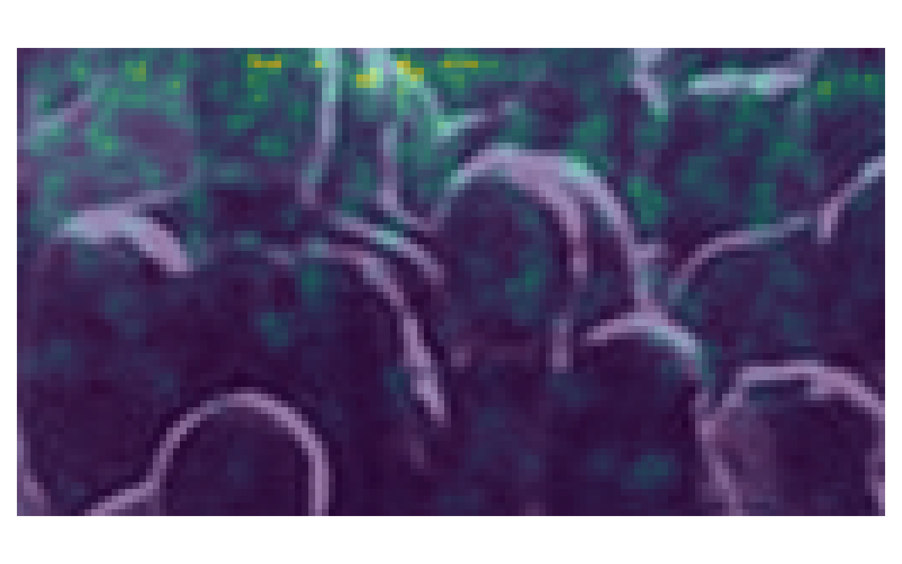
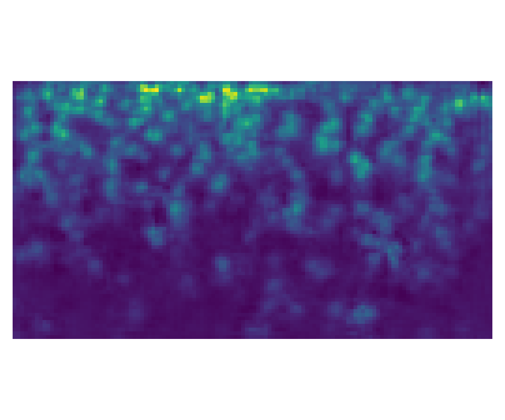

# Crowd Density Estimation & Multimodal XAI Agent

Counting people in highly congested scenes by predicting a **density map** rather than detecting individuals — the
sum of the density map is the predicted head count — and then **explaining** that prediction with a local
multimodal LLM agent that reads the image, the heatmap and the numeric evidence together.

Two halves, one pipeline:

| | |
|---|---|
| **Estimation** | CSRNet (VGG16 + dilated backend) extended with CBAM attention, a combined MSE + SSIM + count loss, and a differential-LR training recipe. |
| **Explanation** | An Ollama-hosted multimodal agent that turns a density map into a structured written report — visual evidence, error analysis, suggested improvements, caveats — and then answers follow-up questions about that specific prediction. Fully local; no image ever leaves the machine. |

> **Result: MAE 61.14 / RMSE 90.91 on ShanghaiTech Part A** — better than the published CSRNet baseline
> (68.2 / 115.0, CVPR 2018) on **both** metrics, at essentially the same model size (16.30M vs 16.26M parameters).

<p align="center">
  
  
</p>

---

## Results

**ShanghaiTech Part A** — 482 congested images (300 train / 182 test), 241,677 annotated people.
Lower is better for both metrics. Following the convention of this literature, the column labelled *MSE* in the papers is actually the **root** mean squared error; it is written as RMSE here.

| Method | Venue | MAE ↓ | RMSE ↓ |
|---|---|---|---|
| MCNN | CVPR 2016 | 110.2 | 173.2 |
| Cascaded-MTL | AVSS 2017 | 101.3 | 152.4 |
| Switching-CNN | CVPR 2017 | 90.4 | 135.0 |
| CP-CNN | ICCV 2017 | 73.6 | 106.4 |
| **CSRNet** *(baseline this repo builds on)* | **CVPR 2018** | **68.2** | **115.0** |
| SANet | ECCV 2018 | 67.0 | 104.5 |
| CAN | CVPR 2019 | 62.3 | 100.0 |
| BL (Bayesian Loss) | ICCV 2019 | 62.8 | 101.8 |
| DM-Count | NeurIPS 2020 | 59.7 | 95.7 |
| **This repo** (`improved`, VGG16 + CBAM) | — | **61.14** | **90.91** |

Numbers for prior work are taken from the original CSRNet paper (Table 5) and cross-checked against the
comparison table in *Bipartite Matching for Crowd Counting with Point Supervision* (IJCAI 2021, Table 1).
See [References](#references).

**Where this lands:** the MAE of 61.14 beats CSRNet, SANet, CAN and BL, and sits between BL and DM-Count.
The RMSE of 90.91 is the stronger half of the result — it is lower than every method in the table above,
which means the model has comparatively few catastrophic failures on the hardest, densest images.

### Our own progression

| Run | Setup | MAE |
|---|---|---|
| Baseline | early runs, Adam, `lr=1e-5`, crop 256, 200 epochs | 82.34 |
| + longer fine-tuning schedule | 300-epoch continuation | 68.87 |
| **+ AdamW, differential LR, warmup + cosine, crop 384** | **400-epoch schedule, best @ epoch 149** | **61.14** |

### Evaluation protocol

Stated plainly, because it matters when comparing against published numbers:

- Metrics are computed over all **182 Part A test images** at full resolution (cropped to a multiple of 8), single forward pass, no test-time augmentation.
- `MAE = mean(|pred − gt|)` and `RMSE = sqrt(mean((pred − gt)²))`, where `pred = sum(density_map)`.
- The Part A test split is also used as the validation set during training, and the reported checkpoint is the epoch with the lowest test MAE (epoch 149 of 400). This is the standard protocol in the crowd-counting literature — CSRNet and the other methods in the table are reported the same way — but it is model selection on the test set, so treat it as a benchmark number rather than an estimate of performance on unseen data.
- **Test-time augmentation made things worse**, not better: multi-scale + flip averaging gave MAE 64.00 / RMSE 100.45. The single-pass number is the one reported.

Raw evidence is committed: [`logs/colab_eval_best_epoch149.txt`](logs/colab_eval_best_epoch149.txt) (the evaluation output) and [`logs/colab_csrnet_improved_20260403_143132.log`](logs/colab_csrnet_improved_20260403_143132.log) (the full per-epoch training log).

---

## What is different from vanilla CSRNet

CSRNet is a VGG16 frontend (down to 1/8 resolution) followed by a dilated-convolution backend. This repo keeps that
skeleton and changes four things, all of which are ablatable via CLI flags:

1. **CBAM attention** (`--model improved`, default) — a Convolutional Block Attention Module after the frontend and after the backend. Channel attention then spatial attention, so the network can re-weight which feature maps and which regions matter before the density head. Cost: **+33,988 parameters** (16,263,489 → 16,297,477), i.e. +0.2%.
2. **Combined loss** (`--loss combined`, default) — pixel-wise MSE (w=1.0) + SSIM loss (w=0.01) + a direct count loss (w=0.01). MSE alone optimises per-pixel density but is indifferent to density-map *structure*; SSIM restores local structure and the count term pins down the quantity actually being reported.
3. **Differential learning rate + warmup** — the pretrained VGG frontend trains at `LR × 0.1` while the randomly-initialised backend and head train at full `LR`, with a 10-epoch linear warmup before cosine decay. This is what stopped the pretrained features being destroyed early in training.
4. **AdamW + gradient accumulation** — `batch_size=1` with 4 accumulation steps (effective batch 4), weight decay 1e-4, gradient clipping at 1.0, AMP mixed precision.

Two further model variants are included for comparison: `original` (faithful CSRNet) and `multiscale`
(three parallel backends at dilation 2/4/8, fused — 33.5M params).

### Architecture

```
Input image (H × W × 3)
      ↓  ImageNet normalisation, cropped to a multiple of 8
Frontend  — VGG16 conv1_1 … conv4_3, 3 max-pools          → H/8 × W/8 × 512
      ↓
CBAM      — channel attention → spatial attention          (improved only)
      ↓
Backend   — 6 × dilated conv3 (dilation 2), 512→512→512→256→128→64
      ↓     dilation keeps the receptive field large without losing resolution
CBAM      — channel attention → spatial attention          (improved only)
      ↓
Head      — conv1×1 → 1 channel → ReLU                     → H/8 × W/8 × 1
      ↓
Predicted count = sum(density map)
```

| Variant | Frontend | Params |
|---|---|---|
| `original` | VGG16 | 16,263,489 |
| `original` | VGG19 | 19,213,377 |
| **`improved`** *(61.14 result)* | **VGG16** | **16,297,477** |
| `improved` | VGG19 | 19,247,365 |
| `multiscale` | VGG16 | 33,533,283 |

---

## Getting started

### 1. Install

```bash
git clone https://github.com/yberkayinci/crowd-density-estimation-multimodal-xai-agent.git
cd crowd-density-estimation-multimodal-xai-agent
python -m venv .venv
source .venv/Scripts/activate     # Windows (Git Bash) — use .venv\Scripts\activate in PowerShell,
                                  # or source .venv/bin/activate on Linux/macOS
pip install -r requirements.txt
```

For GPU training, install the CUDA build of PyTorch from [pytorch.org](https://pytorch.org/get-started/locally/)
before `pip install -r requirements.txt`. Developed against Python 3.12, PyTorch 2.10 + CUDA 12.8.

### 2. Get the dataset

The ShanghaiTech dataset is distributed by its authors and is **not** included in this repo. Download Part A and
arrange it like this:

```
part_A/
  train_data/
    images/            IMG_1.jpg …           (300 images)
    ground-truth/      GT_IMG_1.mat …        (head point coordinates)
  test_data/
    images/            IMG_1.jpg …           (182 images)
    ground-truth/      GT_IMG_1.mat …
```

### 3. Generate density maps

Point annotations are converted to density maps once, up front, and cached as HDF5:

```bash
python preprocessing.py --stride 8 --adaptive --verify
```

Each annotated head becomes a truncated Gaussian kernel, normalised so it integrates to exactly 1 — which is what
makes `sum(density map) == count` hold. The kernel width is **geometry-adaptive**: `sigma = 0.3 × mean(distance to
4 nearest neighbours)`, clamped to `[1.0, 40.0]`, so heads in dense regions get tight kernels and sparse regions get
broad ones. Kernels are stamped within a `3σ` radius rather than convolved over the whole image, making this
`O(σ²)` per point instead of `O(H·W)`.

Output lands in `part_A/*/ground-truth-h5-s8/*.h5` (key `'density'`, `float32`, 1/8 resolution).

### 4. Train

To reproduce the 61.14 run exactly — note `--backbone vgg16`, since the current default is `vgg19`:

```bash
python train.py \
  --model improved --backbone vgg16 \
  --epochs 400 --batch-size 1 \
  --lr 1e-4 --frontend-lr-scale 0.1 --warmup-epochs 10 \
  --optimizer adamw --scheduler cosine \
  --loss combined --ssim-weight 0.01 --count-weight 0.01 \
  --crop-size 384 --seed 42
```

On a Colab Tesla T4 this is roughly 22 s/epoch; the best checkpoint appeared at epoch 149.

Resume an interrupted run:

```bash
python train.py --resume checkpoints/best_model.pth --model improved --backbone vgg16
```

> **A note on resuming:** the cosine scheduler restarts its cycle on resume, so the learning rate jumps back up.
> The resumed 151→400 continuation in this project's log never beat the epoch-149 checkpoint (it hovered at
> MAE 62–64). If you resume near the end of a schedule, drop `--lr` accordingly.

Checkpoints go to `checkpoints/`, logs and a JSON history to `logs/`.

### 5. Predict on a single image

```bash
python predict.py
```

Interactive: pick a random test image or supply your own path. Writes a heatmap and an overlay to `outputs/`,
and prints the predicted count against ground truth when available.

---

## The multimodal XAI agent

A density map tells you *how many*. It does not tell you *why the model believes that*, or *where it is likely to
be wrong* — which is exactly what you need before trusting a count of 1,200 people in a crowd photo.
`xai_ollama.py` closes that gap with a **fully local** multimodal agent.

**What it is given.** Not just the picture. The agent receives three images (the original, the density heatmap and
the overlay) *and* a numeric evidence dictionary extracted from the density map itself — map dimensions, peak
density value and its `(y, x)` location, the percentage of non-zero cells, and the mean and standard deviation of
the density — plus the predicted count and, when available, the ground truth and absolute error. Grounding the
language model in numbers computed from the density map, rather than letting it eyeball a heatmap, is what keeps
the explanation tied to what the network actually did.

**What it produces.** A structured JSON report, enforced via Ollama's `format: json`, rendered to
`outputs/<image>_xai.md` with five sections:

| Section | Answers |
|---|---|
| `summary` | What did the model predict and how does the density distribute? |
| `visual_evidence` | Which regions of the heatmap drive the count? |
| `error_analysis` | Where is the prediction likely to be off, and why? |
| `actionable_improvements` | What would reduce this error — data, augmentation, architecture? |
| `confidence_and_caveats` | How far should this number be trusted? |

**Then it stays open.** After writing the report, `predict.py` drops into an interactive multimodal chat about
that one prediction. The conversation is seeded with the three images and a fixed-facts block (predicted count,
ground truth, absolute error, evidence, the report), so follow-up questions are answered against the actual
prediction rather than the model's general knowledge of crowds.

### Setup

Requires [Ollama](https://ollama.com) running locally with a multimodal model:

```bash
ollama pull qwen3:4b
ollama serve            # expected at http://localhost:11434
```

Then just run `python predict.py` — the XAI step fires automatically after the visualisations are written.
If Ollama is not running, the call is caught and the prediction pipeline continues without it.

---

## Training on Google Colab

`colab_train.ipynb` is a ready-to-run notebook: mount Drive → install deps → check GPU → generate density maps →
train → evaluate → visualise. The 61.14 result was produced with it on a Tesla T4.

---

## Repository layout

```
model.py            Three CSRNet variants + CBAM, behind a create_model() factory
losses.py           SSIM, Count, Combined, Bayesian, Adaptive, Optimal-Transport losses
dataset.py          ShanghaiTech loaders; augmentation (scale, crop, flip, jitter, blur)
preprocessing.py    .mat point annotations → adaptive-Gaussian HDF5 density maps
train.py            Training loop, differential LR, warmup+cosine, AMP, checkpointing
predict.py          Single-image inference, heatmap/overlay rendering, TTA, full-test eval
xai_ollama.py       Local-LLM explanation of a prediction (Ollama)
colab_train.ipynb   End-to-end Colab notebook
logs/               Training logs, per-epoch history, and the 61.14 evaluation output
assets/             Sample prediction visualisations used in this README
```

Checkpoints embed the config they were trained with, so `predict.py` reconstructs the right architecture
automatically — no need to match flags by hand when loading.

### Not included in this repo

`part_A/` (the dataset, redistributed by its authors) and `checkpoints/*.pth` (~195 MB each, above
GitHub's 100 MB file limit).

---

## Limitations

- Trained and evaluated on **Part A only**. No Part B, UCF-QNRF, NWPU or JHU++ numbers — cross-dataset generalisation is untested.
- Best checkpoint selected on the test split (see [Evaluation protocol](#evaluation-protocol)).
- Single run per configuration; no seed-variance study, so small differences between the rows in "Our own progression" should not be over-read.
- The model outputs a count and a density map, not per-person localisation.

---

## References

1. Y. Li, X. Zhang, D. Chen. **CSRNet: Dilated Convolutional Neural Networks for Understanding the Highly Congested Scenes.** CVPR 2018. [arXiv:1802.10062](https://arxiv.org/abs/1802.10062) · [PDF](https://openaccess.thecvf.com/content_cvpr_2018/papers/Li_CSRNet_Dilated_Convolutional_CVPR_2018_paper.pdf) — baseline architecture; Part A MAE 68.2 / RMSE 115.0 (Table 5).
2. Y. Zhang, D. Zhou, S. Chen, S. Gao, Y. Ma. **Single-Image Crowd Counting via Multi-Column Convolutional Neural Network.** CVPR 2016. — MCNN; introduces the ShanghaiTech dataset.
3. S. Woo, J. Park, J.-Y. Lee, I. S. Kweon. **CBAM: Convolutional Block Attention Module.** ECCV 2018. [arXiv:1807.06521](https://arxiv.org/abs/1807.06521) — the attention module added here.
4. X. Cao, Z. Wang, Y. Zhao, F. Su. **Scale Aggregation Network for Accurate and Efficient Crowd Counting.** ECCV 2018. [PDF](https://openaccess.thecvf.com/content_ECCV_2018/papers/Xinkun_Cao_Scale_Aggregation_Network_ECCV_2018_paper.pdf) — SANet.
5. W. Liu, M. Salzmann, P. Fua. **Context-Aware Crowd Counting.** CVPR 2019. [arXiv:1811.10452](https://arxiv.org/abs/1811.10452) — CAN.
6. Z. Ma, X. Wei, X. Hong, Y. Gong. **Bayesian Loss for Crowd Count Estimation with Point Supervision.** ICCV 2019 (oral). [arXiv:1908.03684](https://arxiv.org/abs/1908.03684) — BL.
7. B. Wang, H. Liu, D. Samaras, M. Hoai. **Distribution Matching for Crowd Counting.** NeurIPS 2020. [arXiv:2009.13077](https://arxiv.org/abs/2009.13077) — DM-Count.
8. H. Liu, Q. Zhao, Y. Ma, F. Dai. **Bipartite Matching for Crowd Counting with Point Supervision.** IJCAI 2021. [PDF](https://www.ijcai.org/proceedings/2021/0119.pdf) — Table 1 used to cross-check the comparison numbers above.

## License

Licensed under the **Apache License, Version 2.0** — see [`LICENSE`](LICENSE) and [`NOTICE`](NOTICE).

This covers the code in this repository only. The ShanghaiTech dataset, the pretrained VGG weights fetched at
runtime by torchvision, and the papers referenced above all remain under their own respective terms.

## Acknowledgements

Built on the CSRNet architecture by Li et al., the CBAM attention module by Woo et al., and the ShanghaiTech
dataset by Zhang et al. Density-map generation follows the geometry-adaptive kernel scheme described in the
CSRNet and MCNN papers.
